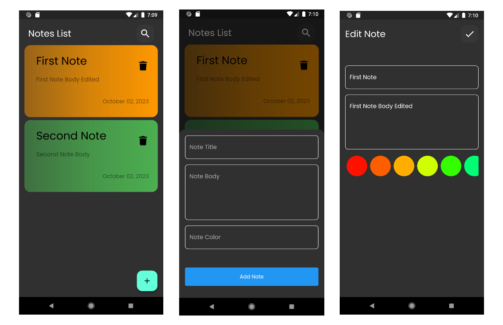

# NotaFlow - Flutter Notes App

NotaFlow is a simple Flutter app designed to help you manage your notes efficiently. With NotaFlow, you can easily create, edit, and remove notes, ensuring you never forget important information again. It utilizes Hive, a local database, to store and manage your notes seamlessly.

## Features

- Create new notes with titles and content.
- View a list of all your notes.
- Edit existing notes.
- Delete notes you no longer need.
- Clean and simple user interface.
- Data persistence for your notes.

## Screenshots
Here are Some of NotaFlow Screen Shots

## Getting Started

To get started with NotaFlow, follow these steps:

1. **Clone the repository**:
<code>git clone [https://github.com/AmerDje/nota_flow_app.git](https://github.com/AmerDje/nota_flow_app.git)</code>

2. **Navigate to the project directory**:
<code>cd nota_flow_app</code>

3. **Install dependencies**:
<code>flutter pub get</code>

4. **Run the app**:
<code>flutter run</code>

## Usage

- Launch the app on your device or emulator.
- To create a new note, click the floating button and fill in the title and content fields.
- To edit a note, tap on the note in the list, make your changes, and click the save button.
- To delete a note, simply tap on delete icon.

## Dependencies

- Flutter: [https://flutter.dev/](https://flutter.dev/)